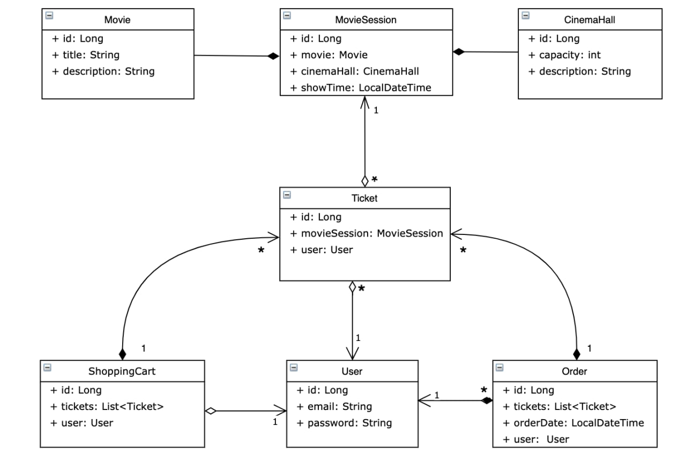

# 🎥 CINEMA-APP 🎞

### ⚡️ Project description
RESTful web app that supports user authentication, authorization and as well as various CRUD operations. Supports roles of user and admin. Allows user to view movies/cinema halls/movie sessions, search for available movie sessions, buy tickets, view shopping cart, complete order, view order. Does not have UI, interaction happens through postman. 

### 📚 Functionality
The Cinema-app provides several key functions for users and administrators:

<b> User Functionality: </b>

- Registration, login, and logout.
- Viewing cinema halls, movies, and available movie sessions.
- Adding tickets to the shopping cart and creating an order based on the added tickets.
- Viewing and completing orders.
- Buying tickets.
- Viewing and updating the shopping cart.

<b> Admin Functionality: </b>

- Adding and managing cinema halls, movies, and movie sessions.
- Finding users by their email address.

### 🎯 Endpoints
The Cinema-app provides the following endpoints:

<b> User and Admin Endpoints: </b>

- POST: /register - User registration.
- GET: /cinema-halls - View cinema halls.
- GET: /movies - View movies.
- GET: /movie-sessions/available - View available movie sessions.

<b> Admin-only Endpoints: </b>

- POST: /cinema-halls - Add a new cinema hall.
- POST: /movies - Add a new movie.
- POST: /movie-sessions - Add a new movie session.
- PUT: /movie-sessions/{id} - Update a movie session.
- DELETE: /movie-sessions/{id} - Delete a movie session.
- GET: /users/by-email - Find a user by their email address.

<b> User-only Endpoints: </b>

- GET: /orders - View user's orders.
- POST: /orders/complete - Complete an order.
- PUT: /shopping-carts/movie-sessions - Update the shopping cart with movie sessions.
- GET: /shopping-carts/by-user - View the shopping cart for a specific user.

### 💡 Architecture
Project consists main layer:
* dao;
* service;
* controller;

### 📖️ Project structure

### 🤖 Technologies Used
* Java 17
* Tomcat 9.0.75
* MySQL 8.0.22
* Maven 3.1.1
* Java Servlet 4.0.1
* Spring 5.3.20
* Spring-Web 5.3.20
* Spring-Security 5.6.10
* Hibernate 5.6.14.Final
* JDBC

### ⚙️ Getting Started
To get started with the Taxi Service project, follow these steps:
1. Clone the repository: git clone https://github.com/khrystyna-dev/cinema-app.git
2. Install Postman for sending requests
3. Set up the MySQL database.
4. Configure field values to your specific properties in [db.properties](src/main/resources/db.properties) in the project. It should contain the database connection settings. Fill in the appropriate values for the following fields:
5. Configure Tomcat server.
6. Run the application.